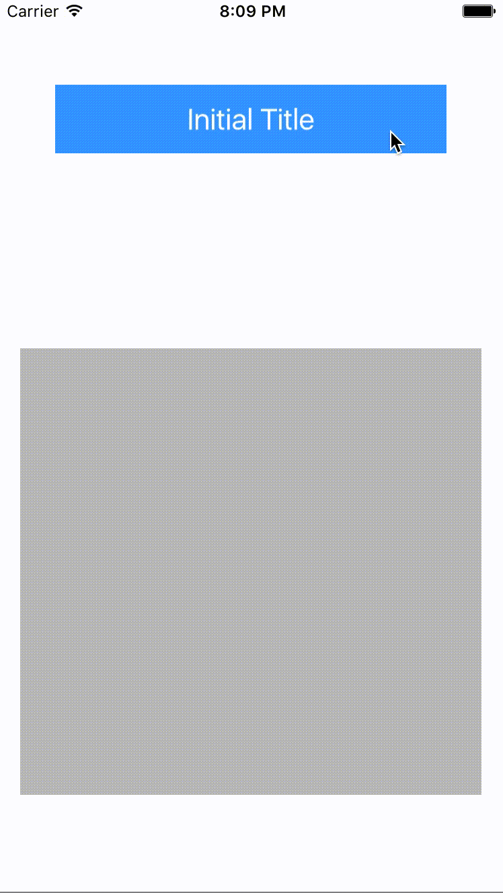

# FFJLoadButton

[](https://travis-ci.org/Vito/FFJLoadButton)
[](http://cocoapods.org/pods/FFJLoadButton)
[](http://cocoapods.org/pods/FFJLoadButton)
[](http://cocoapods.org/pods/FFJLoadButton)

FFJLoadButton is a simple subclass of UIButton written in Swift, which provides animations for loading.




## Usage

FFJLoadButton mainly offers 2 methods:

```Swift
startLoad()
endLoad(_:)
```
Example:

```Swift
self.loadButton.startLoad()

let imageURL = NSURL.init(string: "https://fakeurl.com")
NSURLSession.sharedSession().dataTaskWithURL(imageURL!) { (imageData, response, error) -> Void in
    dispatch_async(dispatch_get_main_queue(), { () -> Void in
        if let _ = error {
            self.imageView.image = nil
            self.loadButton.endLoad(false)
            return
        }
        self.imageView.image = UIImage.init(data: imageData!)
        self.loadButton.endLoad(true)
    })
}.resume()
```
Check demo for more details.

## Installation

#### CocoaPods

FFJLoadButton is available through [CocoaPods](http://cocoapods.org). To install
it, simply add the following line to your Podfile:

```ruby
pod "FFJLoadButton"
```

To run the example project, clone the repo, and run `pod install` from the Example directory first.

#### Manually
Simply drag FFJLoadButton.swift to your project

## Requirements
iOS 8.0+

## Author

zhangchaonb@gmail.com

## License

FFJLoadButton is available under the MIT license. See the LICENSE file for more info.
